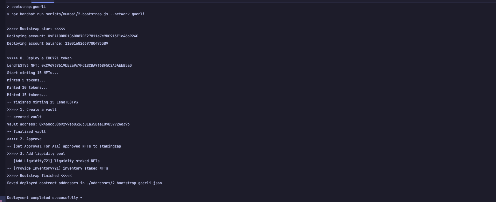

# NFTX Protocol v2
> Forked and enhanced by Bigto Chan.  
> Forked from https://github.com/NFTX-project/nftx-protocol-v2

## Primary Contracts

- StakingTokenProvider
- NFTXLPStaking
- NFTXVaultUpgradeable
- NFTXFeeDistributor
- NFTXVaultFactory
- NFTXEligibilityManager
- Eligibility Modules

## Deploy
> Check `./addresses/` folder

Or you can deploy your own contract


### 1. Setup dev environments:

#### a. Install dependencies:
```shell
yarn install
```

#### b. Compile smart contracts (optional):
```shell
npx hardhat compile
```

#### c. Run test (optional):
```shell
npx hardhat test
```

d. Update your own `.env` file, an example file `.env.sample` is provided.

### 2. Deploy the contracts
#### a. Update config  
> The `WETH` token address is set when the Uniswap router contract was deployed,  
> in Polygon, `WETH` is Wrapped Matic (`WMATIC`)

Get `WETH` address from the deployed Uniswap router contract: `0x1b02da8cb0d097eb8d57a175b88c7d8b47997506`  
Then update the `wethAddress` in `./scripts/mumbai/config.js` file.  
You also need to update `config.network` value

#### b. Run the command to deploy:
```shell
npm run deploy:goerli
# Or
npm run deploy:mumbai
```
You should see below messages print on your terminal:


### 3. Bootstrap the protocol
#### a. Update config
Update `NFTSymbol` and `NFTName`

#### b. Run the bootstrap script
This script mints a ERC721 token, and create liquidity pool
```shell
npm run bootstrap:goerli
```
If no error, you should see below messages print on your terminal:


### 4. Trade the NFT
The script first get the price from the contract, then make a trade.  
Fee is not included in the price we get, so the submitted price is price * 1.2, to cover any fee that required by Uniswap

Run the command to trade:
```shell
npm run trade:goerli
```


Example trade on Goerli: [0x8df653af8c135433b92ea0b54ff7983eb24e4712f062e28731e338ef8744f8ad](https://goerli.etherscan.io/tx/0x8df653af8c135433b92ea0b54ff7983eb24e4712f062e28731e338ef8744f8ad)

## Mainnet Contract Addresses

### Protocol

- StakingTokenProvider: 0x5fAD0e4cc9925365b9B0bbEc9e0C3536c0B1a5C7
- Staking: 0x688c3E4658B5367da06fd629E41879beaB538E37
- Vault template: 0xe8B6820b74533c27786E4724a578Bfca28D97BD1
- FeeDistributor: 0x7AE9D7Ee8489cAD7aFc84111b8b185EE594Ae090
- VaultFactory: 0xBE86f647b167567525cCAAfcd6f881F1Ee558216
- EligibilityManager: 0x4086e98Cce041d286112d021612fD894cFed94D5
- ProxyController address: 0x4333d66Ec59762D1626Ec102d7700E64610437Df
